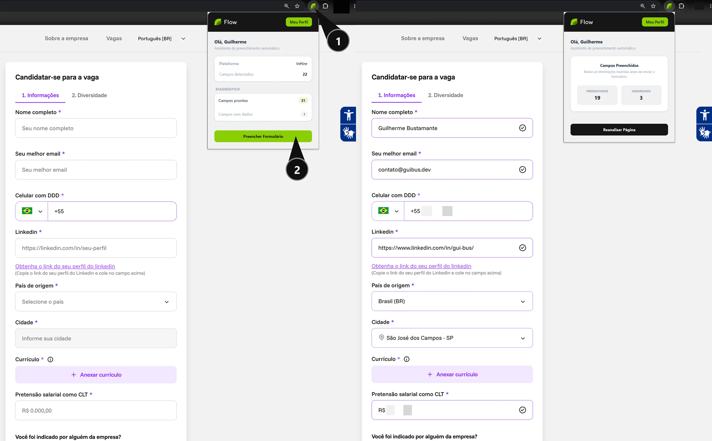
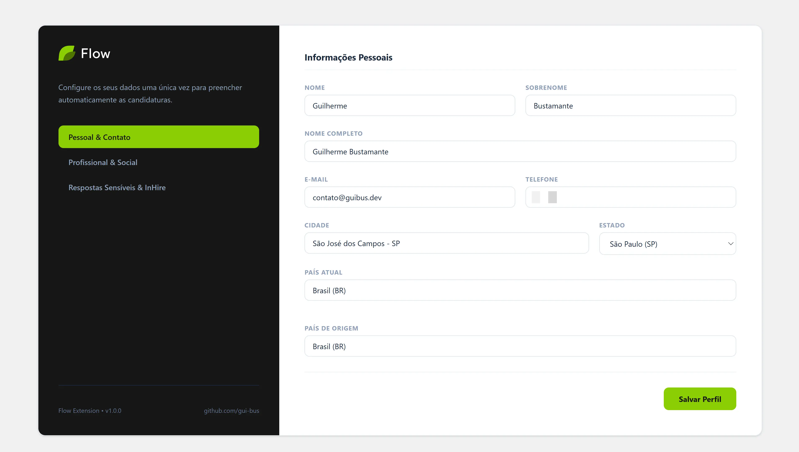

<div align="center">
  <br/>
  <br/>
  
  <br/>
  <br/>
  <p>
    Extensão Chrome para preenchimento automático inteligente de candidaturas a vagas de emprego.
  </p>
</div>

<br />

## 🌟 Visão Geral

O **Flow** é uma extensão para Google Chrome que automatiza o preenchimento de formulários de candidatura a vagas de emprego. Com um único clique, o Flow detecta os campos do formulário na página e injeta os dados do seu perfil de forma inteligente — incluindo informações pessoais, dados de carreira, pretensão salarial e respostas de diversidade e inclusão.

A extensão foi desenvolvida com **Manifest V3**, utilizando WXT como framework de build, React 19 para as interfaces de usuário e Tailwind CSS v4 para estilização. O motor de preenchimento simula eventos nativos do browser (`input`, `change`, `blur`, `click`) para compatibilidade total com formulários controlados por frameworks SPA como React e Vue.

O Flow conta com suporte nativo ao **InHire** — plataforma amplamente utilizada por empresas brasileiras — e com um adaptador genérico que funciona em formulários HTML padrão de qualquer site.

---

## 🎬 Demonstração

<div align="center">
  <p><b>Preenchimento automático do formulário com dois cliques</b></p>
  
</div>

<br/>

<div align="center">
  <p><b>Página de configuração do perfil — onde você insere seus dados</b></p>
  
</div>

---

## 📦 Instalação via Releases (sem precisar buildar)

Você pode instalar o Flow diretamente pelo pacote disponível nas **Releases** do GitHub, sem precisar configurar nenhum ambiente de desenvolvimento.

1. Acesse a página de **[Releases](https://github.com/gui-bus/Flow/releases)** do repositório.
2. Baixe o arquivo `.zip` da versão mais recente.
3. **Extraia** o conteúdo do ZIP em uma pasta no seu computador.
4. Abra o Google Chrome e acesse `chrome://extensions/`.
5. Ative o **Modo do desenvolvedor** (Developer mode) no canto superior direito.
6. Clique em **Carregar sem compactação** (Load unpacked).
7. Selecione a pasta extraída.
8. O Flow estará ativo e disponível na barra de extensões! 🎉

---

## 🛠️ Stack Tecnológica

<div align="center">
  
  
  
  
  
  
  
  
  
</div>

---

## 🏛️ Arquitetura do Projeto

```
Flow/
├── entrypoints/
│   ├── popup/          # Interface do popup (resumo de campos + botão de preencher)
│   ├── options/        # Página de configuração do perfil do usuário
│   ├── background.ts   # Service Worker MV3
│   └── content.ts      # Script injetado nas páginas (análise + preenchimento do DOM)
├── lib/
│   ├── adapters/
│   │   ├── generic.ts  # Adaptador para formulários HTML genéricos
│   │   └── inhire.ts   # Adaptador específico para a plataforma InHire
│   ├── fill.ts         # Motor de preenchimento com simulação de eventos nativos
│   └── storage.ts      # Abstração do chrome.storage.local
├── public/
│   ├── icon/           # Ícones da extensão (16, 32, 48, 96, 128px)
│   └── logo/           # Logos SVG (variantes claro e escuro)
├── types/
│   └── index.ts        # Contratos de tipos TypeScript (UserProfile, DetectedField, etc.)
└── scripts/
    └── strip-comments.js  # Remove comentários antes do build de produção
```

---

## 🚀 Como Rodar em Modo de Desenvolvimento

### Pré-requisitos
- [Node.js](https://nodejs.org/) v18 ou superior
- Google Chrome

### 1. Clone o repositório

```bash
git clone https://github.com/gui-bus/Flow.git
cd Flow
```

### 2. Instale as dependências

```bash
npm install
```

### 3. Inicie o servidor de desenvolvimento

```bash
npm run dev
```

O WXT iniciará o ambiente de hot-reload e abrirá o Chrome automaticamente com a extensão carregada.

### 4. Build de produção

```bash
npm run build
```

O build será gerado em `.output/chrome-mv3/`. Para carregar manualmente no Chrome, acesse `chrome://extensions/`, ative o modo desenvolvedor e clique em **Carregar sem compactação**, selecionando a pasta `.output/chrome-mv3/`.

### 5. Gerar ZIP para distribuição

```bash
npm run zip
```

---

## ✨ Funcionalidades

- **Preenchimento com um clique** — detecta automaticamente os campos do formulário e injeta os dados do perfil
- **Perfil completo** — nome, e-mail, telefone, LinkedIn, localidade, pretensão salarial CLT/PJ, regime de trabalho e mais
- **Diversidade & Inclusão** — respostas configuráveis para gênero, orientação sexual, raça/cor e PCD
- **Compatibilidade com SPAs** — simula eventos nativos (`input`, `change`, `blur`, `click`) para formulários React e Vue
- **Suporte ao InHire** — motor especializado com pre-warm de dropdowns, busca nativa e sequenciamento de campos dependentes
- **Formatação monetária** — pretensão salarial exibida no formato BRL (R$ 10.000,00) em tempo real
- **Armazenamento local** — dados salvos exclusivamente no `chrome.storage.local`, sem servidores externos
